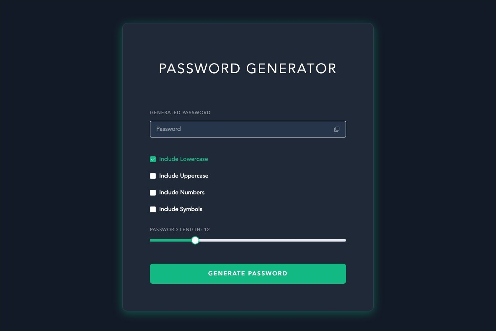

# Password Generator

A small Vue 3 app for generating passwords with the length and character types you choose, then copying them in one click.

**[Live demo →](https://lexa-password-generator.netlify.app/)**



## Features

- **Length from 6 to 32 characters**, set with a slider
- **Character sets you can toggle:** lowercase, uppercase, numbers, and symbols
- **One-click copy** to the clipboard, with a confirmation message

## Built with

Vue 3 (`<script setup>`) · TypeScript · Element Plus · Vite

## Run locally

```sh
npm install
npm run dev
```

Then open the URL Vite prints (usually http://localhost:5173).

> Passwords are generated with `Math.random()`, which is fine for a demo. For real credentials, use a password manager or `crypto.getRandomValues()`.

---

Built by [Lexa Wong](https://www.lexawong.dev/)
